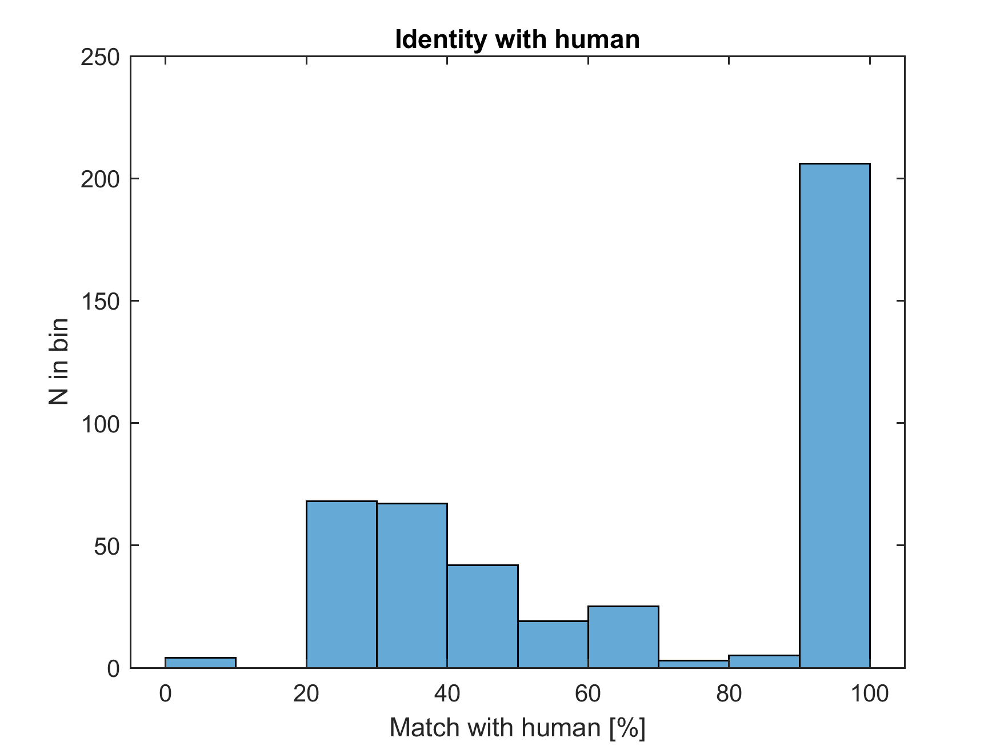
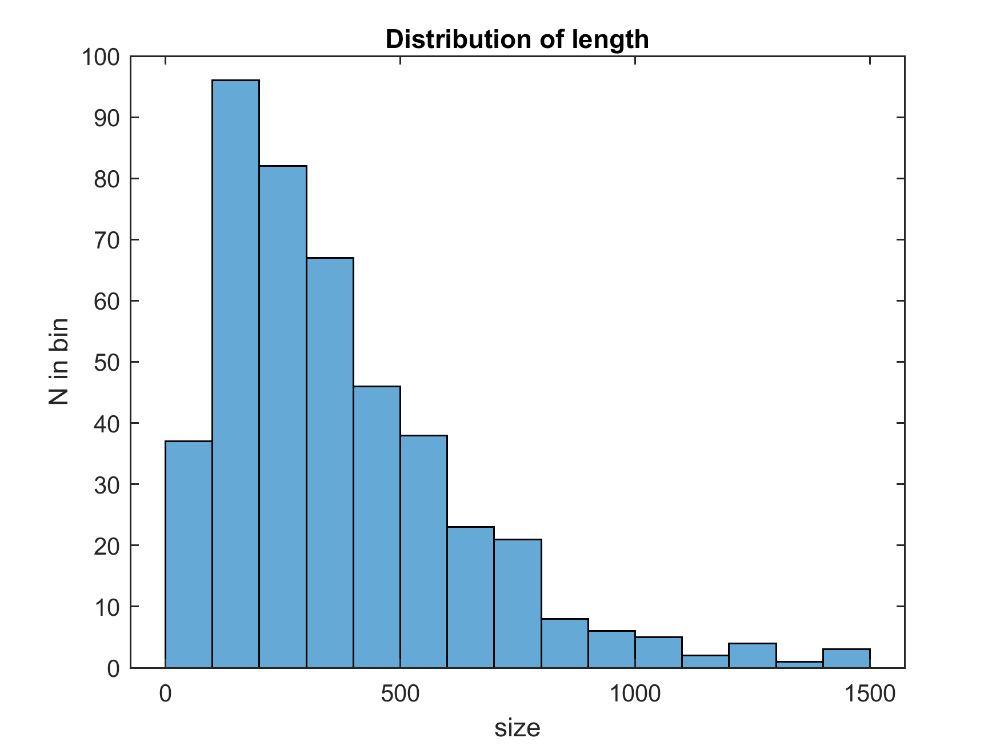
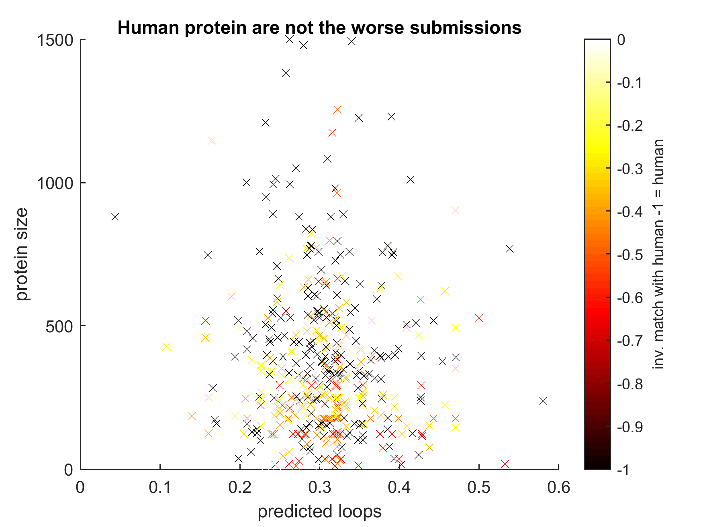

# ITasser_miner
Download the available I-Tasser queue in order to check a few things.

## T&C?
If you stumbled across this repo, please be aware that I do not know if it is within the T&Cs of I-Tasser.
I am not doing anything evil*, so I think it's fine.              
(&lowast; I am not spying on certain protein or individuals, reselling information, eating babies etc. , but I am using up some of their bandwidth, hence the `time.sleep(5)` to stop it from it becomming a DoS attack...)

## Questions

* disorder vs. score?
* Where to cut a protein?
* How much to submit?
* Is everyone hopeless, thus meaning that any consensus is wrong?
* How close to making a human model proteome?
* etc.

### Are folk submitting human protein?
Half.

### What length are folk submitting?
Quite clearly trimmed domains. I don't need to make a human protein refence graph for this.

### Are the human submissions worse?
No. Definitely divergent from the human proteome.

Is it that submissions to ITasser are nice protein only, _i.e._ nobody bothers submitting crap polyproline protein?
